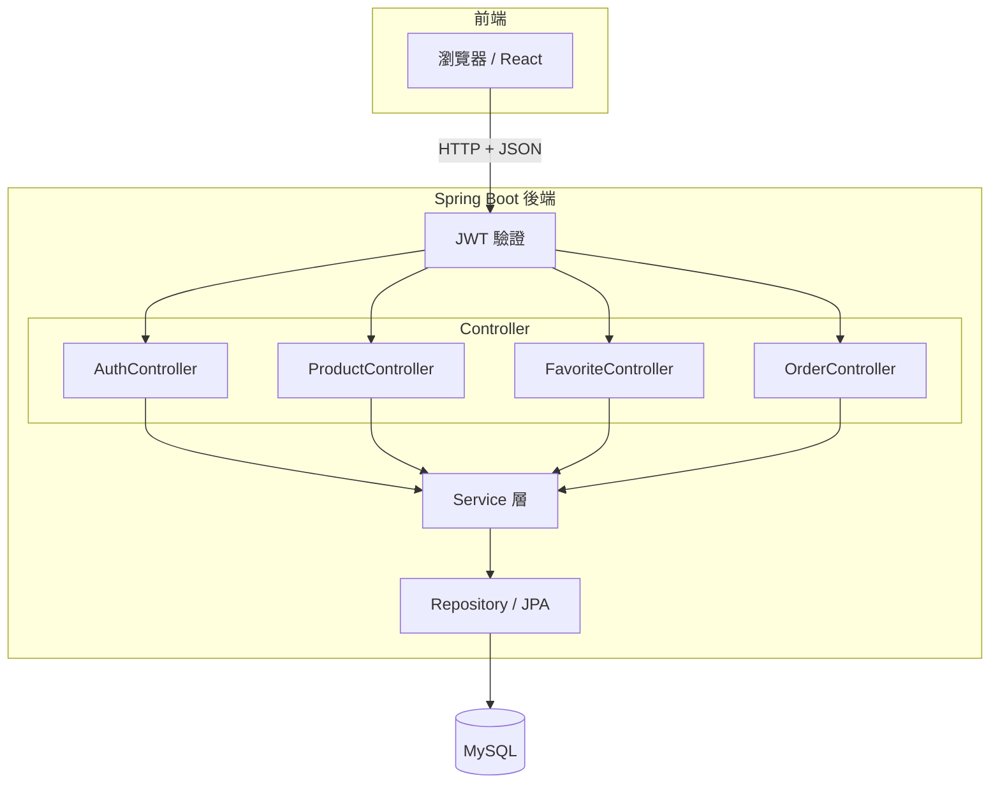

# Java Spring Boot 購物車系統架構設計

## 專案簡介

Spring Boot 購物車後端 + React 前端，REST API，JWT 驗證，MySQL。

## 專案結構

```
SpringBoot/
├── Springboot-cart-backend/
│   └── src/main/java/.../cart/
│       ├── controller/   # Auth, Product, Favorite, Order
│       ├── service/
│       ├── repository/
│       ├── exception/
│       └── response/     # ApiResponse
├── Springboot-cart-frontend/
├── Dockerfile
└── README.md
```

## 技術棧

Java、Spring Boot、Spring Data JPA、MySQL、React、JWT

## 主要功能

- 登入 / JWT（AuthController）
- 商品（ProductController）
- 收藏（FavoriteController）
- 訂單（OrderController）
- 統一錯誤回應（GlobalExceptionHandler + ApiResponse）

## 系統架構


